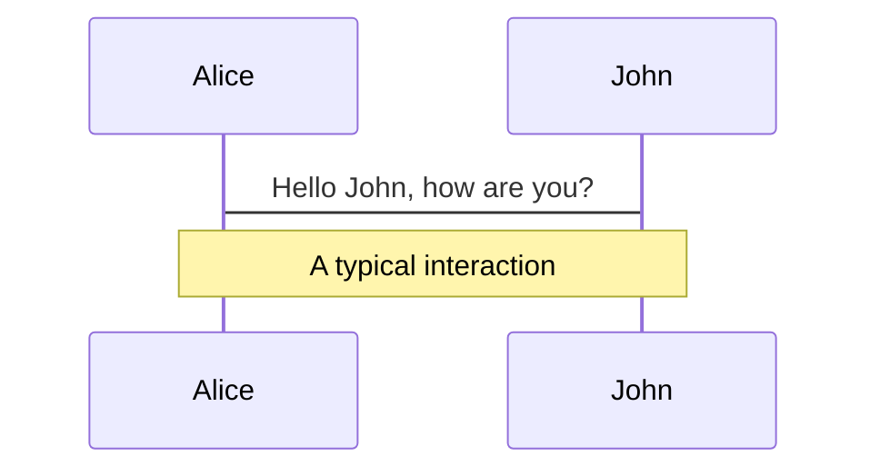
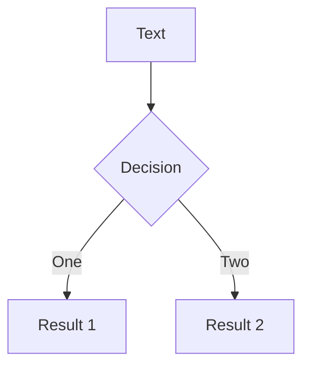
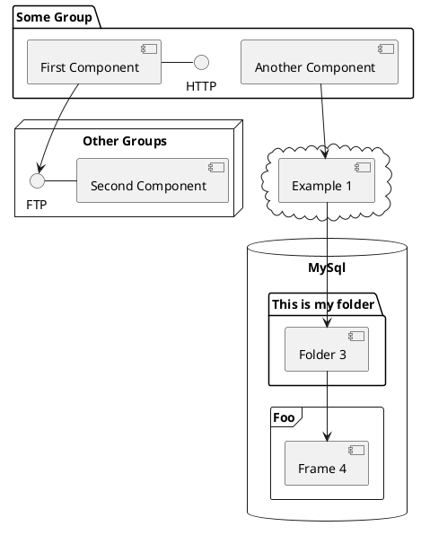

---
# try also 'default' to start simple
theme: bricks
# random image from a curated Unsplash collection by Anthony
# like them? see https://unsplash.com/collections/94734566/slidev
background: https://source.unsplash.com/collection/94734566/1920x1080
# apply any windi css classes to the current slide
class: 'text-center'
# https://sli.dev/custom/highlighters.html
highlighter: shiki
# show line numbers in code blocks
lineNumbers: false
# some information about the slides, markdown enabled
info: |
  ## Slidev Starter Template
  Presentation slides for developers.

  Learn more at [Sli.dev](https://sli.dev)
# persist drawings in exports and build
drawings:
  persist: false
# page transition
transition: slide-left
# use UnoCSS
css: unocss
---

# Welcome to Slidev

Presentation slides for developers

<div class="pt-12">
  <span @click="$slidev.nav.next" class="px-2 py-1 rounded cursor-pointer" hover="bg-white bg-opacity-10">
    Press Space for next page <carbon:arrow-right class="inline"/>
  </span>
</div>

<div class="abs-br m-6 flex gap-2">
  <button @click="$slidev.nav.openInEditor()" title="Open in Editor" class="text-xl slidev-icon-btn opacity-50 !border-none !hover:text-white">
    <carbon:edit />
  </button>
  <a href="https://github.com/slidevjs/slidev" target="_blank" alt="GitHub"
    class="text-xl slidev-icon-btn opacity-50 !border-none !hover:text-white">
    <carbon-logo-github />
  </a>
</div>

<!--
The last comment block of each slide will be treated as slide notes. It will be visible and editable in Presenter Mode along with the slide. [Read more in the docs](https://sli.dev/guide/syntax.html#notes)
-->

---
transition: fade-out
---
# How it all started?

Why did I do that?

---

# Required knowledge

Complexity

<div v-click>

- Javascript / React - easy/medium
- React Native - easy/medium
- GraphQL - easy/medium -> hard

</div>

<div v-click>

- WAT - GOD LEVEL


</div>

---

# Why on Earth did we do it?

What do you need to know

<v-clicks>

- Legacy code
- Mature product
- Staff turn-over

</v-clicks>

<!-- 
## Legacy code

It has a bad connotation, but it is not necessarily awful or not working. It may still do the job, it's just was written long time ago and now nobody dares to touch it

## Mature product

Is the product that is stable in a way, was in development for years, used in production, generates revenue. From the business point of view it "works" and what works must not be broken.

## Staff turn-over

People come and go, they find new jobs, move to another countries take sabbaticals. This means that anyone can end up in a situation when there is not a single person, who can answer questions that start with "Why".
-->

---

# Our stack


---

# Typical request example 

<div grid="~ cols-5 gap-6">
  <div col-span-2>
  
  ```ts
    updateOrderChecklist({
      door: 'checked'
    });
    ...
    updateOrderChecklist({
      boiler: 'works'
    });
    ...
    updateOrderChecklist({
      boiler_CO2: 33.3
    });
  ```
  
  </div>

  
</div>

---
layout: image-right
image: https://source.unsplash.com/collection/94734566/1920x1080
---

# Salesforce limits imposed on the frontend team

<v-clicks>

- number of long-running requests
- number of requests
- DB locks

</v-clicks>

---

# Example

<style>
  .img {
    height: 70%;
    margin-top: 30px;
  }
</style>


<!-- 
# Problems in numbers
* Update #1 takes 500ms - 3seconds to complete
* User clicks fast, as a result we have 2-3 overlapping requests
* On the Frontend we usually don't care, it's not our problem, Backend must handle it.
* In our case it was not an option. FE teams was told that this problem CANNOT be fixed on the BE.
-->

---

# Solution direction

<div>Updates must be done in sequence</div>

<v-click>

<div>From Salesforce this will reduce all 3 limits:

- number of API calls
</div>

</v-click>

<v-clicks>

- reduced SF load -> fewer long lasting requests
- Fewer DB locks (since we’ll have fewer requests in parallel).

</v-clicks>


<!-- 
If we cannot run requests in parallel, we have to run them consecutively. One after another, yes.

-  since 1 user will be adding only 1 request at a time
- 

-->

---

# Success criteria
## Customer always comes first

* From customer point of view nothing changes, they should still be able work with app without noticing ANY delays
* Actual changes (mutations) are executed in sequence

---

# GraphQL links


GraphQL offers a way to customize Apollo Client's data flow with something called Links:
* logging link
* error handler link
* execution time link

The key here is **Link chain** TODO (Add Dineris saying "I want to break the chain" crossed).

---

# What is a link?

```ts
import { ApolloLink } from '@apollo/client';

const timeStartLink = new ApolloLink((operation, forward) => {
  operation.setContext({ start: new Date() });
  return forward(operation);
});
```

The forward function's return type is an Observable provided by the **zen-observable** library. See the 
zen-observable documentation for details.


---

# How it should be

<style>
  .row {
    display: flex;
    align-items: center;
    flex-direction: row;
  }
  .img {
    height: 70%;
    margin-top: 30px;
  }
  .second {
    margin-left: 30px;
  }
  .third {
    margin-left: 80px;
  }
</style>


---

# GraphQL mutation

<div grid="~ cols-2 gap-5">

```ts
// Mutation definition
const UPDATE_COMMENT = gql`
  mutation UpdateComment($commentId: ID!, 
    $commentContent: String!) {
    updateComment(commentId: $commentId, 
      content: $commentContent) {
      id
      __typename
      content
    }
  }
`;
```

```ts
// Component definition
function CommentPageWithData() {
  const [mutate] = useMutation(UPDATE_COMMENT);
  return (
    <Comment
      updateComment={({ commentId, commentContent }) =>
        mutate({
          variables: { commentId, commentContent },
          optimisticResponse: {
            updateComment: {
              id: commentId,
              __typename: "Comment",
              content: commentContent
            }
          }
        })
      }
    />
  );
}
```

</div>

---

# OrderChecklist updates

```ts
updateOrderChecklist({
  variables: {
    id: ‘order_1’,
    door: 'checked'
  },
  optimistic: {
    id: ‘order_1’,
    door: 'checked',
    price: 50
  },
});
```

<!-- At this point whenever a mutation is performed, user will always see a result of an optimistic response first and in 99.9% cases optimistic response will match the actual response.
But requests are still executed in parallel. Let’s fix it. -->

---
layout: center
theme: bricks
image: rabbit.png
---

# Let's create a link!

---

# Empty link

```ts
export const queuedLink = new ApolloLink((operation, forward) => {
  return forward(operation);
});
```


---

# Create a queue

```ts {1,4|all}
const queue = [];

export const queuedLink = new ApolloLink((operation, forward) => {
  queue.push(operation);

  return forward(operation);
});
```


---

# Return Observable, save item in queue

<div v-click-hide>

```ts {1,4-20|all}
const queue = [];

export const queuedLink = new ApolloLink((operation, forward) => {
  
  return new Observable((observer) => {
    queue.push({
      operation,
      forward,
      observer,
    });

    return () => {};
  });
});
```

</div>


---

# Execute queue

```ts {3-5,16|all}
const queue = [];

const executeQueue = async () => {
  // execute an operation and return the result
}

export const queuedLink = new ApolloLink((operation, forward) => {

  return new Observable((observer) => {
    queue.push({
      operation,
      forward,
      observer,
    });

    executeQueue();

    return () => {};
  });
});
```

---

# Execute queue

```ts {3,6-17|all}
const queue = [];

let queueRuning = false;

const executeQueue = async () => {
  if (queue.length === 0 || queueRuning) {
    return;
  }

  queueRuning = true;

  const nextItem = queue.shift();

  // do some async work

  queueRuning = false;
  executeQueue();
 }

export const queuedLink = new ApolloLink((operation, forward) => {
  .......
```

---

<style>
  #code-block pre * {
    font-size: 0.9em !important;
  }
</style>

# Execute queue

<div id="code-block">

```ts {3-18|3|5|6|7-10|11-13|14-17|all}
const executeQueue = async () => {
  ...
  const { forward, operation, observer } = queue.shift();

  forward(operation)
    .subscribe(
      async (result) => {
        observer.next(result);
        observer.complete();
      },
      (error) => {
        observer.error(error);
      },
      () => {
        queueRuning = false;
        executeQueue();
      },
    );
}

export const queuedLink = new ApolloLink((operation, forward) => {
  ...
```

</div>


---

# Summary

### What did we achieve?

1. it works
2. we have something in our lives to be shamed about

### Important considerations
- All mutations that go to consecutive queue must have an optimistic response
  - To make sure a user doesn’t see any difference
- Optimistic response should be correct
  - Otherwise a user will see UI changing after the actual response is received

---

# Cherry on top
### Let's make it work in Offline!

```ts {4-12,16}
const queue = [];

let queueRuning = false;
let isOffline = false;

NetInfo.addEventListener(state => {
  isOffline = state.isInternetReachable !== true
  
  if (!isOffline) {
    executeQueue();
  }
});

const executeQueue = async () => {
  if (queue.length === 0 || queueRuning 
    || isOffline) {
    return;
  }
```

---

# Further thoughts on IDs
### A rabbit starts it's journey

- IDs. If you create a new object and then edit it before you received a response from server, 
you don’t know what Object.ID you want to update/delete.
  - Can be fixed by having a dictionary with key-value pairs where the key is temp ID and 
  value is an actual ID after a response is receive. 
    - For every mutation you’ll need to go through all variables in the payload and replace 
    temp value with actual one if found
      - Automated iteration in every field of the payload (may be intensive) or custom logic for 
      some of the mutations (needs to be maintained separately) - your choice.

<!-- ---
layout: center    -->
---

<style>
  .imgg {
    height: 300px;
  }
</style>

# Don't fall into it

<div grid="~ cols-4">
  <span grid="~ col-span-1"></span>
  
  <span grid="~ col-span-1"></span>
</div>


---

# What is Slidev?

Slidev is a slides maker and presenter designed for developers, consist of the following features

- 📝 **Text-based** - focus on the content with Markdown, and then style them later
- 🎨 **Themable** - theme can be shared and used with npm packages
- 🧑‍💻 **Developer Friendly** - code highlighting, live coding with autocompletion
- 🤹 **Interactive** - embedding Vue components to enhance your expressions
- 🎥 **Recording** - built-in recording and camera view
- 📤 **Portable** - export into PDF, PNGs, or even a hostable SPA
- 🛠 **Hackable** - anything possible on a webpage

<br>
<br>

Read more about [Why Slidev?](https://sli.dev/guide/why)

<!--
You can have `style` tag in markdown to override the style for the current page.
Learn more: https://sli.dev/guide/syntax#embedded-styles
-->

<style>
h1 {
  background-color: #2B90B6;
  background-image: linear-gradient(45deg, #4EC5D4 10%, #146b8c 20%);
  background-size: 100%;
  -webkit-background-clip: text;
  -moz-background-clip: text;
  -webkit-text-fill-color: transparent;
  -moz-text-fill-color: transparent;
}
</style>

<!--
Here is another comment.
-->

---
transition: slide-up
---

# Navigation

Hover on the bottom-left corner to see the navigation's controls panel, [learn more](https://sli.dev/guide/navigation.html)

### Keyboard Shortcuts

|     |     |
| --- | --- |
| <kbd>right</kbd> / <kbd>space</kbd>| next animation or slide |
| <kbd>left</kbd>  / <kbd>shift</kbd><kbd>space</kbd> | previous animation or slide |
| <kbd>up</kbd> | previous slide |
| <kbd>down</kbd> | next slide |

<!-- https://sli.dev/guide/animations.html#click-animations -->

<p v-after class="absolute bottom-23 left-45 opacity-30 transform -rotate-10">Here!</p>

---
layout: image-right
image: https://source.unsplash.com/collection/94734566/1920x1080
---

# Code

Use code snippets and get the highlighting directly![^1]

```ts {all|2|1-6|9|all}
interface User {
  id: number
  firstName: string
  lastName: string
  role: string
}

function updateUser(id: number, update: User) {
  const user = getUser(id)
  const newUser = { ...user, ...update }
  saveUser(id, newUser)
}
```

<arrow v-click="3" x1="400" y1="420" x2="230" y2="330" color="#564" width="3" arrowSize="1" />

[^1]: [Learn More](https://sli.dev/guide/syntax.html#line-highlighting)

<style>
.footnotes-sep {
  @apply mt-20 opacity-10;
}
.footnotes {
  @apply text-sm opacity-75;
}
.footnote-backref {
  display: none;
}
</style>

---

# Components

<div grid="~ cols-2 gap-4">
<div>

You can use Vue components directly inside your slides.

We have provided a few built-in components like `<Tweet/>` and `<Youtube/>` that you can use directly. And adding your custom components is also super easy.

```html
<Counter :count="10" />
```

<!-- ./components/Counter.vue -->
<Counter :count="10" m="t-4" />

Check out [the guides](https://sli.dev/builtin/components.html) for more.

</div>
<div>

```html
<Tweet id="1390115482657726468" />
```

<Tweet id="1390115482657726468" scale="0.65" />

</div>
</div>

<!--
Presenter note with **bold**, *italic*, and ~~striked~~ text.

Also, HTML elements are valid:
<div class="flex w-full">
  <span style="flex-grow: 1;">Left content</span>
  <span>Right content</span>
</div>
-->


---
class: px-20
---

# Themes

Slidev comes with powerful theming support. Themes can provide styles, layouts, components, or even configurations for tools. Switching between themes by just **one edit** in your frontmatter:

<div grid="~ cols-2 gap-2" m="-t-2">

```yaml
---
theme: default
---
```

```yaml
---
theme: seriph
---
```


</div>

Read more about [How to use a theme](https://sli.dev/themes/use.html) and
check out the [Awesome Themes Gallery](https://sli.dev/themes/gallery.html).

---
preload: false
---

# Animations

Animations are powered by [@vueuse/motion](https://motion.vueuse.org/).

```html
<div
  v-motion
  :initial="{ x: -80 }"
  :enter="{ x: 0 }">
  Slidev
</div>
```

<div class="w-60 relative mt-6">
  <div class="relative w-40 h-40">
    
    
    
  </div>

  <div
    class="text-5xl absolute top-14 left-40 text-[#2B90B6] -z-1"
    v-motion
    :initial="{ x: -80, opacity: 0}"
    :enter="{ x: 0, opacity: 1, transition: { delay: 2000, duration: 1000 } }">
    Slidev
  </div>
</div>

<!-- vue script setup scripts can be directly used in markdown, and will only affects current page -->
<script setup lang="ts">
const final = {
  x: 0,
  y: 0,
  rotate: 0,
  scale: 1,
  transition: {
    type: 'spring',
    damping: 10,
    stiffness: 20,
    mass: 2
  }
}
</script>

<div
  v-motion
  :initial="{ x:35, y: 40, opacity: 0}"
  :enter="{ y: 0, opacity: 1, transition: { delay: 3500 } }">

[Learn More](https://sli.dev/guide/animations.html#motion)

</div>

---

# LaTeX

LaTeX is supported out-of-box powered by [KaTeX](https://katex.org/).

<br>

Inline $\sqrt{3x-1}+(1+x)^2$

Block
$$
\begin{array}{c}

\nabla \times \vec{\mathbf{B}} -\, \frac1c\, \frac{\partial\vec{\mathbf{E}}}{\partial t} &
= \frac{4\pi}{c}\vec{\mathbf{j}}    \nabla \cdot \vec{\mathbf{E}} & = 4 \pi \rho \\

\nabla \times \vec{\mathbf{E}}\, +\, \frac1c\, \frac{\partial\vec{\mathbf{B}}}{\partial t} & = \vec{\mathbf{0}} \\

\nabla \cdot \vec{\mathbf{B}} & = 0

\end{array}
$$

<br>

[Learn more](https://sli.dev/guide/syntax#latex)

---

# Diagrams

You can create diagrams / graphs from textual descriptions, directly in your Markdown.

<div class="grid grid-cols-3 gap-10 pt-4 -mb-6">







</div>

[Learn More](https://sli.dev/guide/syntax.html#diagrams)

---
src: ./pages/multiple-entries.md
hide: false
---

---
layout: center
class: text-center
---

# Learn More

[Documentations](https://sli.dev) · [GitHub](https://github.com/slidevjs/slidev) · [Showcases](https://sli.dev/showcases.html)
